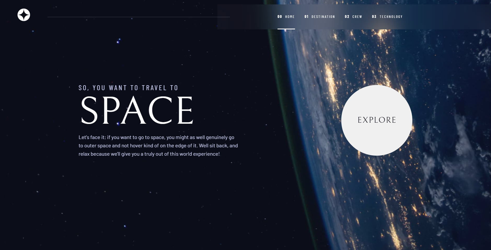

# Frontend Mentor - Space tourism website solution

This is a solution to the [Space tourism website challenge on Frontend Mentor](https://www.frontendmentor.io/challenges/space-tourism-multipage-website-gRWj1URZ3). Frontend Mentor challenges help you improve your coding skills by building realistic projects. 

## Table of contents

- [Overview](#overview)
  - [Screenshot](#screenshot)
  - [The challenge](#the-challenge)
  - [Links](#links)
- [My process](#my-process)
  - [Built with](#built-with)
  - [What I learned](#what-i-learned)
- [Author](#author)

**Note: Delete this note and update the table of contents based on what sections you keep.**

## Overview

This was a very important project in my life, it may not be the most challenging or intriguing thing in the world, but it has a huge emotional appeal for me because I had difficulties in my personal life while developing it.

I developed this project using ReactJS, I started the project using Vite.
This Website helped me reinforce my knowledge of ReactJS and its main libs, libs like StyledComponent, React-Router-dom or FramerMotion.

In the distant future I intend to change some things that I don't agree with and I believe I could have done better on the site.

### Screenshot

### The challenge

Users should be able to:

- View the optimal layout for each of the website's pages depending on their device's screen size
- See hover states for all interactive elements on the page
- View each page and be able to toggle between the tabs to see new information

### Links

- Solution URL: [https://github.com/Rickrasin/Space-Tourism-Website](https://github.com/Rickrasin/Space-Tourism-Website)
- Live Site URL: [https://space-tourism-website-eight-rho.vercel.app](https://space-tourism-website-eight-rho.vercel.app)

## My process

### Built with

- Semantic HTML5 markup
- CSS custom properties
- Flexbox
- CSS Grid
- Mobile-first workflow
- [Vite](https://vitejs.dev) - For Build & Start Project
- [React](https://reactjs.org/) - JS library
- [Styled Components](https://styled-components.com/) - For styles
- [FramerMotion](https://www.framer.com/motion/) - For styles

### What I learned

I may not have implemented it in the project, as it would take time that I could not make available to this project, but I learned a lot about how to develop Slides using libraries in Unity, I also learned the importance of accessibility for the user and improved my knowledge with Responsive Websites.

Something that helped me a lot were the problems with routes I had with the site, this forced me to see a lot of content on the subject and really learn how React-Router-Dom works.

## Author

- Frontend Mentor - [@Rickrasin](https://www.frontendmentor.io/profile/Rickrasin)
- Linkedin - [@Rickson-Oliveira-](https://Linkedin.com/in/rickson-oliveira-/)

